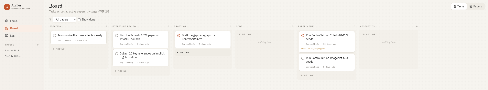

# Atelier

**A local-first research tracker for people writing multiple papers at once.**

Atelier is a small web application for managing the parallel work involved in research. Papers don't progress linearly; they accumulate work across six parallel, non-linear stages — *Ideation*, *Literature Review*, *Drafting*, *Code*, *Experiments*, *Aesthetics*. The unit of work is the task, and tasks are what moves on the Kanban board. State lives in a single JSON file that travels between your machines.



---

## Why this exists

Researchers running several papers in parallel face a specific, recurring problem. Generic project-management tools model work as a linear pipeline: a ticket moves from "backlog" to "in progress" to "done," and a project moves from phase to phase. Research doesn't work that way. At any given moment, a paper has writing that's drafted, code that's half-finished, experiments running in the background, figures nobody's touched yet, and a literature review still missing three citations — all at once. The paper itself doesn't "progress" — it accumulates work in several dimensions simultaneously.

Atelier is built around that reality. The board shows tasks, not papers. The columns are work categories, not pipeline phases. A paper is a long-running accumulation, not a ticket.

---

## The model

### Six stages

Non-linear. A paper can have work in any subset of these at once.

| Stage | What it covers |
|-------|----------------|
| **Ideation** | Clarifying the research question, hypothesis, conceptual method |
| **Literature Review** | Finding, reading, organizing citations |
| **Drafting** | Writing the manuscript text |
| **Code** | Implementation, scripts, notebooks, infra |
| **Experiments** | Running experiments, gathering results, statistics |
| **Aesthetics** | Figures, diagrams, plots, schematics |

### Ideation sub-stages

The "thinking layer" that lives underneath the task layer. Each paper has seven free-form note fields corresponding to the conceptual parts of a paper:

- Title
- Research Question / Gap
- Hypothesis
- Methodology (concept)
- Experiment design (concept)
- Outlook
- Conclusion

Each note carries a 0–4 *maturity* score indicating how clear the idea is in your head:

| Level | Name | Meaning |
|-------|------|---------|
| 0 | Empty | Nothing there yet |
| 1 | Vague | Rough intuition, not articulable |
| 2 | Drafted | Can explain it but it has holes |
| 3 | Solid | Could defend it in a meeting |
| 4 | Defended | Survived adversarial pushback or review |

The rules engine uses these to generate suggestions — when your Methodology note is at 3/4 but you have no Drafting tasks, it's time to write it down.

### Tasks

The unit of work. Every task has:

- A **stage** (one of the six)
- A **status** — `todo`, `in_progress`, or `done`
- A **paper** it belongs to
- A title, optional notes, optional rationale (for suggested tasks)

Tasks are what moves on the Kanban. Drag a task across stages to re-classify it.

### Per-paper completion

Each paper has a completion status per stage. By default, a stage is "done" when all its tasks are done (auto-computed). You can also manually mark a stage complete — useful when the "work" lives outside the task list. Manual marks are sticky; if you later add an open task to a manually-completed stage, a warning icon appears, but the mark doesn't auto-undo. You decide.

A paper's overall completion is shown as the fraction of stages that are effectively done.

### WIP limits

The WIP limit applies to **tasks in the `in_progress` status**, not to papers. You can have many active papers; what gets limited is how many things you're actively touching right now. Default is 3; configurable in Settings.

---

## The rules engine and prioritization

Atelier uses a Multi-Criteria Decision Making (MCDM) utility model to rank tasks. Every task — whether you create it yourself or accept it from a suggestion — is rated on five dimensions, and a sixth (switch cost) is computed from context:

| Symbol | Name | Range | What it captures |
|--------|------|-------|------------------|
| V | Impact | 0.3 / 0.6 / 1.0 | How much this moves the paper toward acceptance |
| P | Probability | 0.4 / 0.7 / 0.9 | How likely the task is to succeed |
| I | Information gain | 0 / 0.5 / 1.0 | Whether completing it reshapes the plan |
| T | Time sensitivity | 0.3 / 0.6 / 1.0 | How much delay reduces its value |
| C | Effort | 1 / 2 / 3 | Time/energy required |
| S | Switch cost | 0 / 0.5 / 1 | Context-switch from the focused task (computed) |

The utility function is:

```
U = V · P · (1 + I) · T  /  (C + S)
```

This decomposition is grounded in Expected Utility Theory, WSJF (Weighted Shortest Job First), temporal discounting, and cognitive-load research. The numerator rewards high-impact, high-probability, plan-shaping work under time pressure; the denominator penalizes effort and context-switching.

The seven rules in [`src/state/suggestions.ts`](src/state/suggestions.ts) are *feature generators* — they detect situations (a deadline is close, an idea is mature but unwritten, a stage is overloaded) and emit suggestion objects with appropriate criteria. The same utility function ranks both manual tasks and suggestions, so they compete on a single axis.

When you create a task, you pick all five criteria explicitly. The friction is deliberate: you cannot avoid stating what you think the task is worth. Criteria are editable later from the task detail panel.

Suggestions detected by the engine:

1. **Idea is clear, nothing written.** An Ideation sub-stage with maturity ≥ 2 and substantive notes, but no Drafting tasks yet → suggest a drafting task.
2. **Ideation without production.** A paper older than 14 days with Ideation progress but nothing in Drafting/Code/Experiments → time to produce something.
3. **Stage overload.** A stage with 4+ open tasks → consolidate before adding more.
4. **Stale in-progress.** A task sitting `in_progress` for 7+ days → revive or drop; it's holding WIP budget hostage.
5. **Deadline pressure.** Deadline within 21 days and drafting incomplete → prioritize drafting.
6. **Aesthetics bottleneck.** Code/Experiments progressing but no Aesthetics tasks → figures often block submission.
7. **Scattered work.** Active work in 4+ stages simultaneously → pick one to finish.

Accepted suggestions become ordinary tasks, carrying their criteria. Dismissed ones are suppressed until state changes enough to produce a new suggestion.

---

## Productivity principles baked into the design

A handful of principles are structural to the app rather than bolted-on reminders. The reasoning behind each lives in [`docs/design-principles.md`](docs/design-principles.md).

- **One thing today.** The Focus view foregrounds a single top-ranked item.
- **Concrete next actions.** Suggestion titles are phrased as verb-led tasks ("Draft the gap paragraph for…"), not vague goals.
- **WIP limits on tasks.** Taken from Kanban/lean; limits context switching and partially-done work.
- **Stale detection.** Papers and in-progress tasks idle beyond thresholds get flagged so you can consciously resume, reshape, or pause.
- **Two-layer idea/text separation.** The Ideation sub-stage maturity score and the task layer are independent, mirroring the real gap between knowing what you want to say and having written it down.
- **Weekly review.** Guided template prefilled with the week's activity stats (papers touched, tasks completed, stale papers).
- **No celebratory UI.** No streaks, badges, confetti. The reward for good research is the paper, not the app.

---

## Architecture

```
research-atelier/
├── src/
│   ├── types.ts                 Domain model
│   ├── state/
│   │   ├── store.ts             Zustand store + selectors
│   │   ├── persistence.ts       JSON export/import + v1→v2 migration
│   │   └── suggestions.ts       Deterministic rules engine
│   ├── lib/
│   │   └── dates.ts             Date helpers
│   ├── components/
│   │   ├── BoardView.tsx        Kanban: tasks by stage
│   │   ├── FocusView.tsx        Ranked queue of tasks + suggestions
│   │   ├── PaperDetail.tsx      2×3 stage grid with ideation sub-stages
│   │   ├── DiaryView.tsx        Log + weekly review
│   │   ├── TaskCard.tsx
│   │   ├── TaskDetailModal.tsx
│   │   ├── NewTaskModal.tsx
│   │   ├── NewPaperModal.tsx
│   │   ├── Sidebar.tsx
│   │   ├── EmptyState.tsx
│   │   └── ui/Primitives.tsx
│   ├── App.tsx
│   ├── main.tsx
│   └── index.css
├── examples/state.example.json  Sample v2 state
├── docs/design-principles.md
└── (config: vite, tsconfig, tailwind, postcss)
```

### Stack

- **React 18** + **TypeScript** strict
- **Vite** for dev and build
- **Tailwind CSS** with a custom warm palette
- **Zustand** for state
- **date-fns** for date arithmetic
- **lucide-react** for icons

### State persistence

State lives in three places, in authority order:

1. **Your exported `state.json`** — canonical, source of truth
2. **Browser localStorage** — auto-saved working copy between sessions on the same browser
3. **React state** — live during a session

Sync is explicit, by design. Export on machine A, copy the file to Dropbox / Drive / a git repo / a USB stick, import on machine B. No backend, no account, no cloud. The app works offline forever.

---

## Getting started

```bash
git clone <your-fork-url> research-atelier
cd research-atelier
npm install
npm run dev         # http://localhost:5173
# — or —
npm run build
npm run preview     # static build, works from anywhere
```

### Trying the example state

1. Launch the app.
2. Sidebar → **Import state**.
3. Select `examples/state.example.json`.
4. Two papers appear, with realistic tasks spread across stages. The Focus view shows what the rules engine flags as most important.

### Syncing between machines

Export on machine A → sync via your medium of choice → import on machine B. The state file is pretty-printed JSON, diff-friendly.

### Migrating from v1

If you used the earlier version of Atelier (with paper-stage pipelines and the Title/Gap/Hypothesis/... section model), just import your old `state.json`. The migration runs automatically:

- Paper pipeline stages (`paused` / `submitted` / `published`) map to the new `paused` / `archived` flags.
- Paper sections (conceptual + manuscript scores, notes) map to the new Ideation sub-stage notes. Conceptual scores carry over as maturity.
- Tasks are assigned `stage='ideation'` by default; you can re-sort them on the new board.

---

## Roadmap ideas

Not promises — directions that fit the philosophy:

- Command palette (⌘K) for keyboard-driven navigation
- Per-paper markdown export of all tasks + logs
- Activity-over-time view (not Gantt — a simple timeline)
- Optional Obsidian integration — one-way export of ideation notes as linked markdown

Deliberately not planned: multi-user collaboration, cloud sync, LLM-generated suggestions, mobile app, Gantt charts.

---

## License

MIT. See [LICENSE](LICENSE).
